# Term One Coder Academy Workbook

1. ## Components and concepts of web development and markup languages

    Web development is generally referred to as the tasks and associated operations with building and maintaining functional web sites. Web     developers use markup languages as the fundamental building blocks to create pages and sites on the internet (Kyrnin, 2021).Content in general needs structure to be presented. Markup languages give individuals a standard and formal way of structuring documents for machine-based processing. Each markup has its own set of rules for structuring content and documents defined by the language or some framework (https://www.researchgate.net/publication/252519961_Structuring_Content_with_XML). Several markup languages have contributed to the growth of the internet and the development of the world wide web. Hypertext (HTML) is a markup language that is one of the web’s fundamental building blocks. It serves the purpose of providing a method to access and link different types of information in a document on the internet. Each document acting as a web of information nodes which can be inspected at the will of the user (http://info.cern.ch/hypertext/WWW/Proposal.html). One of the main driving principles behind Hypertext is to provide the ability of uninterrupted movement between information sources.Hypertext basically provides the means of navigating information on the internet.Leading on from this, Hypertext provides a standard way of structuring and formatting documents so that web browsers, applications and users can read the content. This is achieved by using tags and attributes to define elements and describe the documents’ logical structure or how it should be styled (https://www.encyclopedia.com/computing/news-wires-white-papers-and-books/markup-languages).

2. ## Features of technologies essential to the development of the internet (Packets, IP, Routing, DNS)

    Packet switching is one of the underlying foundational technologies of the internet. The concept of packet switching arose from the need to have a system of communications that avoids a single point of failure and could operate reliably if damaged.  Packet switching is a method used for communicating over a network (https://www.carritech.com/news/packet-switching-explained/). Packets are small chunks of information reasonably sized for ease of transmission over the physical network. Each packet is responsible for carrying data of variable length. On top of this, each packet has a source and a destination in the form of a unique identifying address. Packets are used to break large pieces of data down into smaller separable blocks so it can be transmitted over different routes. Following on from this, packets are an integral part of being able to transmit data without having to prearrange a connection to the device intended to communicate with (Univeristy, 2022).  A network based on packet switching works better, faster and is cheaper for communicating data than traditional dedicated circuit switched networks. Because network bandwidth is shared, multiple simultaneous communications can occur. This is the key concept that makes the internet possible.( https://web.archive.org/web/20140702224203/http://www.livinginternet.com/i/iw_packet_inv.htm).

    IP addressing is the key to realising connections of separate LANs (local are networks), so long as hosts have a valid IP address and logical address planning , communication is possible. (https://blog.router-switch.com/2021/01/the-development-of-network-hardware/) IP (Internet Protocol) addresses are used to distinctly identify devices connected to a network. An IP address is a string of numbers used to define the network and device locations for sending data. IP addresses are vital in communication over networks as they give a digital address for packets to be sent and received. Internet Protocol version 4 or IPv4 utilises 4 numbers separated by periods ranging from 0 to 255. As the number of devices connecting to the internet has exponentially increased since the inception of IP and IP addresses the need for more addresses has led to the creation of IPv6. IPv6 utilises 8 hexadecimal numbers allowing for a much larger sum of total addresses (Fox, 2020).  IP addresses are classified as public, private, static and dynamic. Static IP addresses are created manually and do not change while dynamic IP addresses are assigned and are subject to change. Private IP addresses are allocated to a host for use inside a private network for communicating with other devices on the network is not assigned for communication with devices on another network (https://isaaccomputerscience.org/concepts/net_internet_ip_addresses?examBoard=all&stage=all). 

    The concept of using a router provides a system independent interface to the internet and is one of the driving factors contributing to its growth. A router is a piece of peripheral hardware that extends the capabilities of a network of computer systems. Its basic function serves to allow computers with different system configurations to communicate successfully ( https://apps.dtic.mil/sti/pdfs/AD0686811.pdf). Routing is defined as the process of moving packets from a source to a destination. In order to achieve this, the router holds a table in its memory that is comprised of a list of all the networks the device is connected to. The list also contains other important information relating to how busy each path is between networks at any current time. When data arrives as a packet, the router will open the header and read the destination. Following on from this, it then checks all the available routes to the specified address. Additionally, each path is examined for congestion and the packet is then sent on its fastest calculated path. Routers can also perform additional tasks such as exchanging protocol information over networks and filtering traffic.There are three primary classifications of routing which include Default, Static and Dynamic. Default routing is generally performed by a stub router which relies on a single route to all other networks. In static routing, a network administrator manually adds paths to routing tables and packets travel fixed routes. Dynamic routing is a process by which data is forwarded via routes that are calculated based on current network activity, routing tables are automatically updated based on the fastest route. ( https://www.webopedia.com/definitions/routing/#:~:text=In%20networking%2C%20routing%20is%20the,device%20known%20as%20a%20router.)

    The Domain Name System or DNS for short, is a decentralised system for naming and identifying computers on the internet or other IP networks. Its purpose is to translate human readable host names into numerical IP addresses (https://en.wikipedia.org/wiki/Domain_Name_System).
    Information online is generally accessed using domain names which is a unique string of human readable text that refers to a specific numerical IP address. Domain names are divided into three sections separated by a period. Each identifying section is a descendant of the domain to its right. Domain names are an integral component of URLs or uniform resource locators (What is DNS?, n.d.).

3. ## Features of technologies essential to the development of the internet (TCP, HTTP, HTTPS, Browsers)
   
    TCP or transmission control protocol is a set of rules defining how data is transferred over a network. TCP is one of the most used protocols for sending data. TCP works by establishing a connection between the client and server. Following on from this, it ensures the connection remains open until transmission is initiated. Lastly, TCP breaks down large chunks of data into smaller packets whilst still maintaining data integrity in the process (Fox, n.d.).Once the connection is established, the client and server are required to send each other synchronisation and acknowledgment packets. The purpose of this is to engage both ends for communication and to negotiate the limits of the network connection at either end before any meaningful data is sent (Shalom, 2020).

    HTTP or Hypertext Transfer Protocol is the integral structure underpinning the delivery of data for the World Wide Web. HTTP is nested on top of TCP and has continued to evolve since its inception (MDN, n.d.). HTTP defines interactions between the client and web server by specifying permitted client requests and server response. The function of HTTP is to initiate a connection between the user’s browser and the server for sending of html pages. When using HTTP, the connection between client and server is only maintained for the duration of each request/response. In addition to HTTP is HTTPS (Neeva, 2021). HTTPS or Hypertext Transfer Protocol Secure is an encrypted version of HTTP based on the sending and receiving of security certificates.This ensures users and clients identities are consistent and data remains secure (Cloudflare, n.d.).

    Web browsers are a foundational part of the World Wide Web. Browsers for short, let users access files on a local network or the web. A browser is an application designed to process and render HTML into human readable content. Most browsers contain common features such as browsing history, private-mode and bookmarks (Techterms, 2014).  Web browsers use HTTP or HTTPS to retrieve content from the web or from a local storage device for displaying to the user. In doing this, the browser is essentially acting as the client to contact a server and request information. (https://smartbear.com/blog/history-of-web-browsers/)

4. ## Data Structures in Ruby

    An array is a fundamental data structure of programming and is useful for performing operations on whole collections of elements rather than individual variables. An advantage of using an array is once they are declared they can be reused multiple times. (Miralles,  Arrays are data structures that represent a set of elements that can be selected by indices and computed upon at runtime during a programs execution. An array is used to store multiple elements of similar type together so they can be called upon by a common name (https://www.geeksforgeeks.org/ruby-arrays/). An array is a fundamental data structure of programming and is useful for performing operations on whole collections of elements rather than individual variables. An advantage of using an array is once they are declared they can be reused multiple times. (Miralles,). Arrays store data contiguously and unlike other low level languages Ruby uses dynamic arrays. 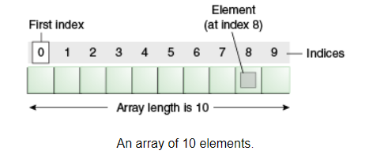 
      

    A hash is a data structure that is generally like an array. A Hash differs from an array in that, instead of indexing by integer a hash allows the use of key/value pairs. This is useful for dealing with large or nested arrays and aids in fast access of elements if the key is known. (Miralles, 2018).  Hashes are the fastest storage structure for data and makes them essential for situations in which a computer system is interacting with data rather than a human (https://everythingcomputerscience.com/discrete_mathematics/Data_Structures/Hash_Table.html).
      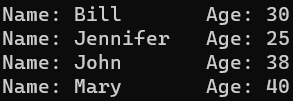

    A linked list is a data structure consisting of an element (node) which holds two key pieces of information, the data and a reference to the next node. It is a linear set of elements and is useful for storing and managing collections of data. https://medium.com/analytics-vidhya/implement-a-linked-list-in-ruby-2aae925acd9c) . It is similar to an array however, the key difference lies in memory allocation. A linked list can be stored as just its nodes in separate blocks of memory. Which results in greater flexibility of memory allocation for other objects and doesn’t use any extra space than is needed. 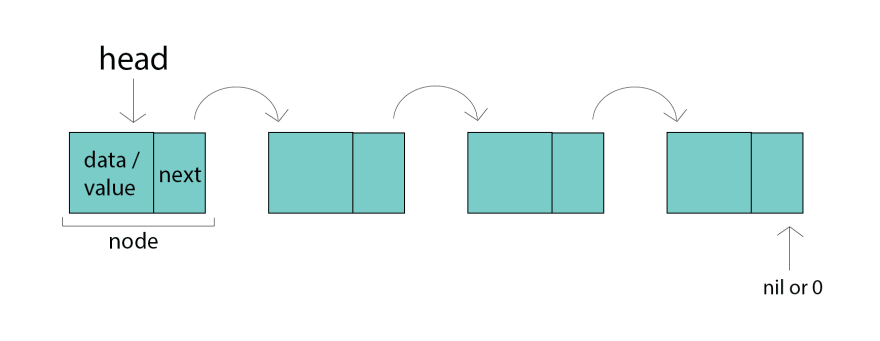 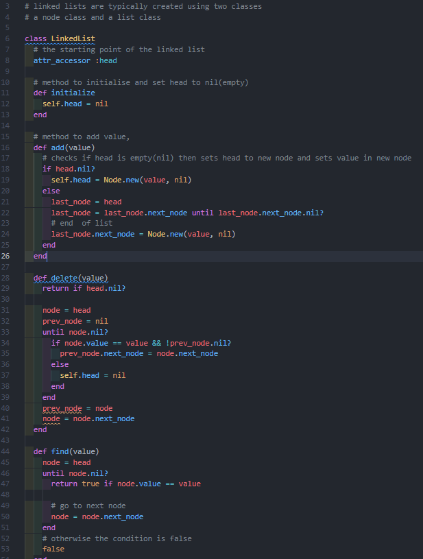 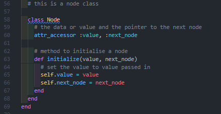

5. ## Compilers & Interpreters

    An interpreter translates source code into binary. It does this sequentially by reading, translating and executing each instruction before moving on to the next line. Because of this, interpreted code is generally slower to run. Each time the program is run the script must be translated all over again. However, because of this errors may be easier to catch.
    A compiler is a program that translates source code from one programming language into a target language. Usually from a high-level language into a low-level language that is executable on a specific system.  It uses the source code as its set of instructions which it performs a series of processes on to produce machine code. These processes include lexical, syntactic and semantic analysis, code generation and optimisation. Once the program has finished compiling, errors are reported and upon fixing will need to be compiled again. This cycle repeats until there is no errors in the program.  While this may take time to compile, it results in faster run times as no further translation is needed. 

6. ## Benefits and drawbacks of Ruby & C

    Ruby is a popular programming language currently in use and its benefits include easily readable/writable syntax, open source with lots of easily accessible documentation and frameworks. One of the drawbacks of ruby is its scalability due to it being an interpreted language (McAllister, 2012).Ruby is a free, high-level, general-purpose language. Ruby is object orientated, simplistic in its design and emphasizes productivity. Ruby is a scripting language that can be used for a variety of applications such as front and back-end web development, data processing and automation(https://developer.oracle.com/ruby/what-is-ruby/). Some of it’s features include portability, easy syntax and a rich set of built in functions just to name a few. (https://www.tutorialspoint.com/ruby/ruby_overview.htm). Because Ruby is a scripting language and must be interpreted, it may perform slower than a lower-level language (https://ruby-doc.com/docs/ProgrammingRuby/html/trouble.html).
    C is a programming language that is procedural in nature that is compiled to gain access to low-level memory. C is a structured language and is procedure orientated. Often referred to as a mid-level programming language due to it’s code being suitable for high and low-level programs.  C is based on ASCII characters; this gives the benefit of being able to run on a wide range of systems making it machine independent( https://prosancons.com/computer/pros-and-cons-of-c-programming-language/). Lack of exception handling is a disadvantage for C as bugs and errors may be harder to catch. Once the program has been written it must be compiled and all errors are shown at the same time. This can make checking code problematic and time consuming (https://www.includehelp.com/c/advantages-and-disadvantages-of-c-programming-language.aspx).

7. ## nil

8. ## Control Flow

    A script interpreter starts processing statements sequentially, starting at the first line of code. The sequential flow of execution can be determined with control statements (https://www.ibm.com/docs/en/tivoli-monitoring/6.3.0?topic=language-flow-control-statements). A control statement provides the means to alter and control the sequence of applied statements. There are many kinds of control flow some of those being sequencing, selection and iteration. Sequencing is the order in which statements are executed and refers to executing statements one after another. Selection is a decision-making process and the result changes the path of the program. Iteration is the repetition of some process and is often referred to as looping (https://www.bbc.co.uk/bitesize/guides/z433rwx/revision/4). 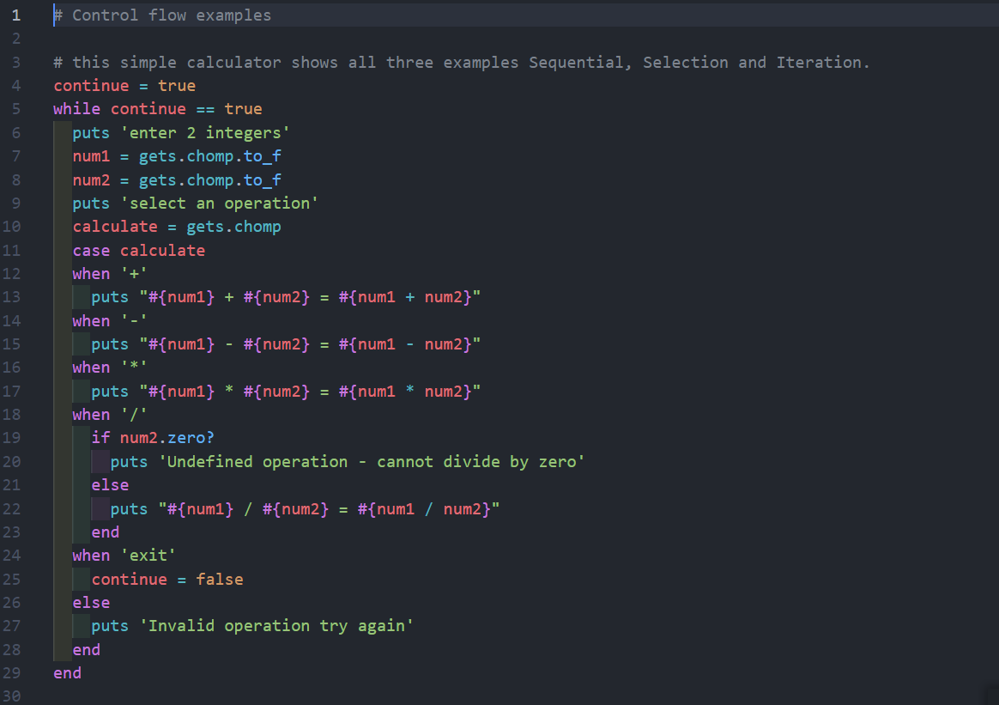

9.  ## Type Coercion

    Type coercion happens because data is stored as one type but the context it is required in is a different data type. Type coercion is converting a datum to a different type of data in an expression (http://faculty.salina.k-state.edu/tmertz/Java/041datatypesandoperators/07typecoercionandconversion.pdf).In general, coercion refers to implicit conversion which is an automatic process run by the compiler to avoid loss of data when one or more data types are present in an expression (https://www.geeksforgeeks.org/implicit-type-conversion-in-c-with-examples/). Explicit conversion is stated within a program and defined by the user. 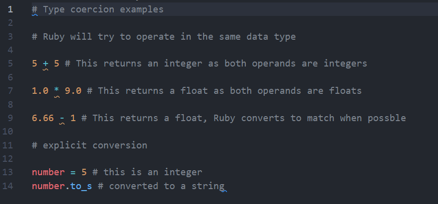

10. ## Data types

    A data type defines the nature of a variable and its range of values. Data types also define memory allocation for each type. Data types are allocated different sized chunks of memory based on their type. In Ruby, data types are referred to as classes. Like other object orientated languages, a class in Ruby is a description of objects (Computer Science Programming Basics in Ruby).
    
    Data types in Ruby include strings, numbers, symbols, arrays, hashes and Booleans. Each representing a specific type of data and what operations can be performed on them. 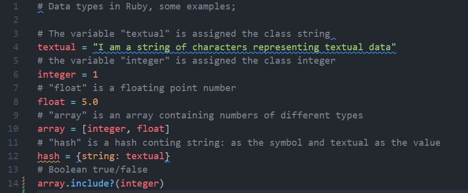

11. ## Code Error

   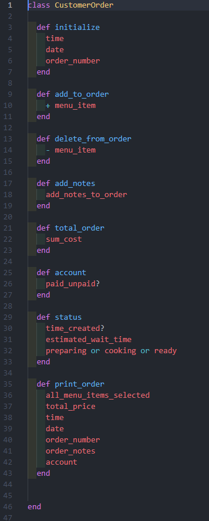  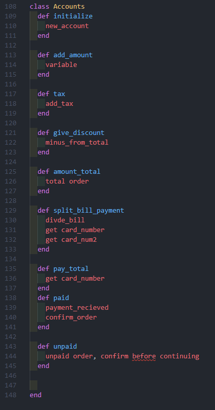

12. ## Code Snippet

    

13. ## Code Snippet Two

     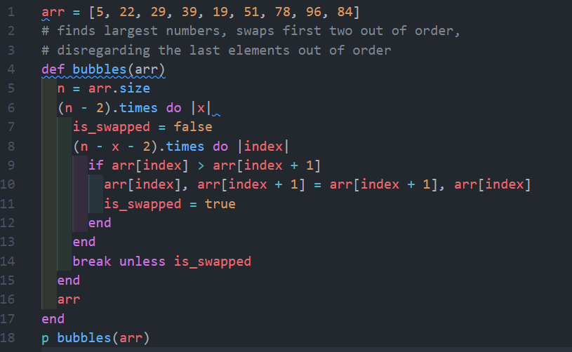

14. ## Prime Sieve

    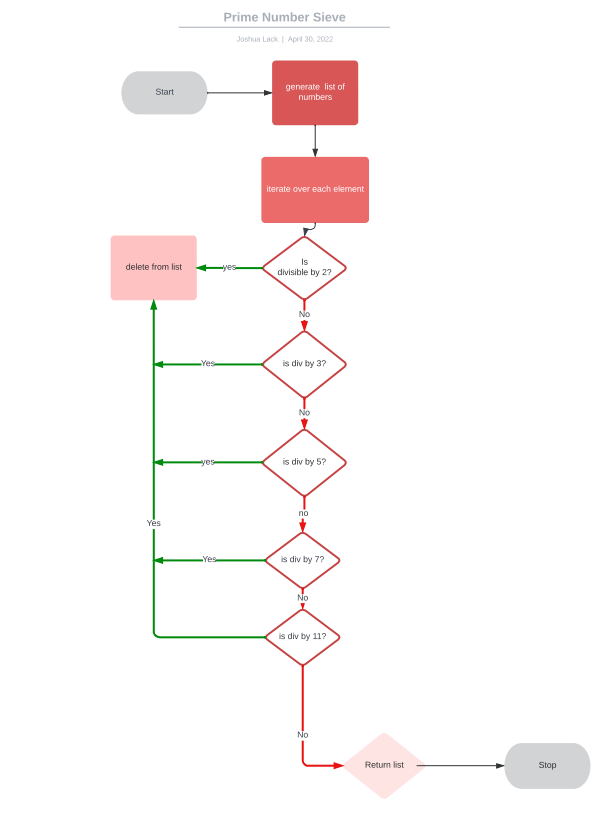 [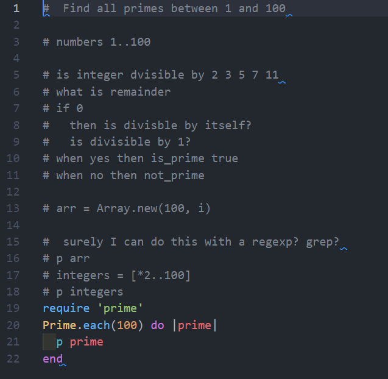 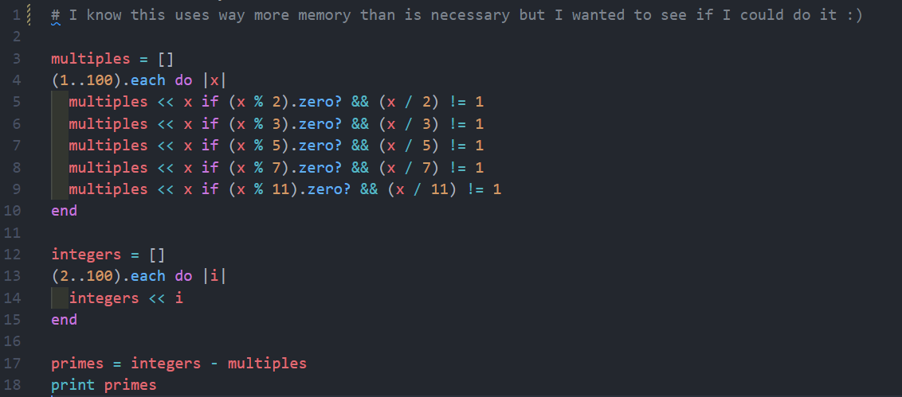

15. ## Raining Pseudocode

    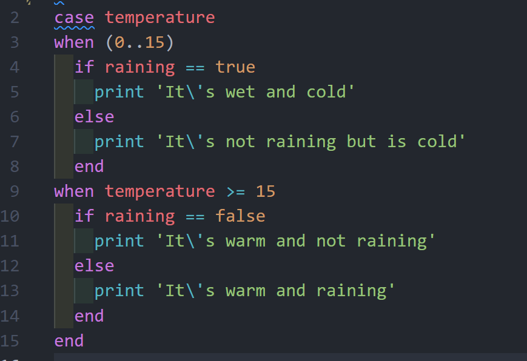

 ## REFERENCES
------

Cloudflare.com. n.d. What is DNS?. [online] Available at: <https://www.cloudflare.com/en-au/learning/dns/what-is-dns/> [Accessed 22 March 2022].

Cloudflare.com. n.d. What is HTTPS?. [online] Available at: <https://www.cloudflare.com/en-au/learning/ssl/what-is-https/> [Accessed 22 March 2022].

Cloudflare.com. n.d. What is routing?. [online] Available at: <https://www.cloudflare.com/en-gb/learning/network-layer/what-is-routing/> [Accessed 22 March 2022].

Developer.mozilla.org. n.d. An overview of HTTP - HTTP | MDN. [online] Available at: <https://developer.mozilla.org/en-US/docs/Web/HTTP/Overview> [Accessed 22 March 2022].

Fox, P., 2020. Khan Academy. [online] Khanacademy.org. Available at: <https://www.khanacademy.org/computing/computers-and-internet/xcae6f4a7ff015e7d:the-internet/xcae6f4a7ff015e7d:addressing-the-internet/a/ip-v4-v6-addresses?modal=1> [Accessed 22 March 2022].

Fox, P., n.d. Transmission Control Protocol (TCP) (article) | Khan Academy. [online] Khan Academy. Available at: <https://www.khanacademy.org/computing/computers-and-internet/xcae6f4a7ff015e7d:the-internet/xcae6f4a7ff015e7d:transporting-packets/a/transmission-control-protocol--tcp> [Accessed 22 March 2022].

Kyrnin, J., 2022. What Are Markup Languages?. [online] ThoughtCo. Available at: <https://www.thoughtco.com/what-are-markup-languages-3468655#:~:text=For%20web%20design%20and%20development,HTML%2C%20XML%2C%20and%20XHTML.> [Accessed 22 March 2022].

McAllister, N., 2012. Twitter survives election after Ruby-to-Java move. [online] Theregister.com. Available at: <https://www.theregister.com/2012/11/08/twitter_epic_traffic_saved_by_java/#:~:text=Micro%2Dblogging%20site%20Twitter%20experienced,Java%20for%20its%20backend%20software.> [Accessed 22 March 2022].

Miralles, A., 2014. Mastering data structures in Ruby — Graphs. [online] Medium. Available at: <https://medium.com/amiralles/mastering-data-structures-in-ruby-graphs-caa5892d50b1#:~:text=A%20graph%20is%20a%20data,this%20is%20vertex%2Fnode.)> [Accessed 22 March 2022].

Neeva, T., 2021. What is HTTP? How It Works and Related Safety Concerns. [online] Neeva. Available at: <https://neeva.com/learn/what-is-http> [Accessed 22 March 2022].

Shalom, N., 2020. What is a Three-Way Handshake? - Definition from Techopedia. [online] Techopedia.com. Available at: <https://www.techopedia.com/definition/10339/three-way-handshake> [Accessed 22 March 2022].

Techterms.com. 2014. Web Browser Definition. [online] Available at: <https://techterms.com/definition/web_browser> [Accessed 22 March 2022].

University, I., 2022. What is a packet?. [online] Kb.iu.edu. Available at: <https://kb.iu.edu/d/anyq#:~:text=Packets%20evolved%20due%20to%20the,end%20can%20transmit%20to%20another.> [Accessed 22 March 2022].
